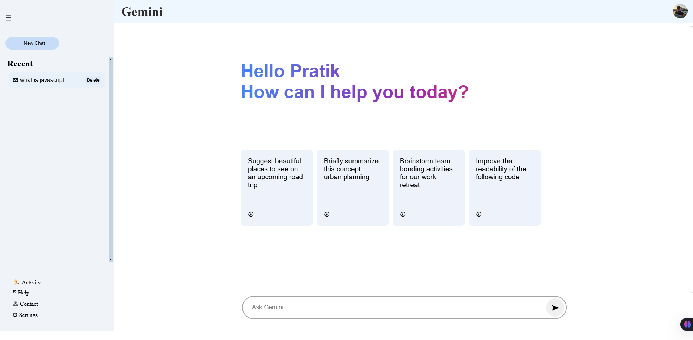
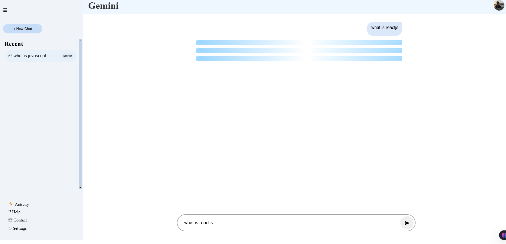
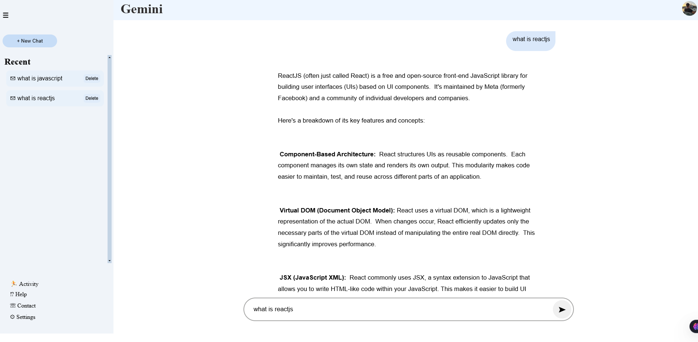

# 🌟 Google Gemini Clone ✨

Welcome to the **Google Gemini Clone**, a sleek and responsive AI-powered chatbot application! 🚀 Built using **ReactJS** and leveraging the **Google Gemini APIs**, this app provides intelligent and interactive conversational experiences. 💬

> **Live Demo:** [Check it out here! 🌐](https://gemini-ai-clone-steel.vercel.app/)

---

## 📸 Screenshots

### 🏠 Home Screen:


### 💬 Chat in Action:


### 📜 Recent Conversations:


---

## 🛠️ Features
- 🧠 **AI-Powered Conversations:** Seamlessly interact with the Google Gemini API for smart and natural chat.
- 🔄 **Recent Chats:** View your conversation history with the ability to revisit or delete past chats.
- 🚀 **Responsive Design:** Optimized for both desktop and mobile devices.
- 💾 **Local Storage Integration:** Save and retrieve your chat history.
- ⚡ **Dynamic Sidebar:** Toggle between your chat history and AI responses with ease.
- ⚛️ **Built with ReactJS:** The app is developed using ReactJS, enabling a fast, scalable, and efficient frontend experience.

---

## ⚙️ Installation & Setup

Follow these steps to get started with the project:

1. **Clone the Repository** 📂
   ```bash
   git clone https://github.com/PRATIKSINDHIYA/Gemini-Ai_Clone.git
   cd Gemini-Ai_Clone
   ```

2. **Install Dependencies** 🧰
   Make sure you have **Node.js** and **npm** installed. Then, install the necessary dependencies:
   ```bash
   npm install
   ```

3. **Add Your API Key** 🔑
   - Create a `.env` file in the root directory:
     ```
     REACT_APP_API_KEY=your-google-gemini-api-key
     ```

4. **Start the run Server** 🌐
   ```bash
   npm run dev
   ```
   ```

---

## 🖥️ Deployment

You can deploy the app using any hosting platform like **Netlify**, **Vercel**, or **GitHub Pages**.

1. **Build the Project**
   ```bash
   npm run build
   ```

2. **Deploy the `/build` Folder**
   Upload the `build` folder to your chosen platform.

---

## 🛡️ Security
🚨 **Important:** Make sure to keep your API key secure. Avoid exposing it in the frontend by using server-side proxy solutions.

---

## 👏 Acknowledgments
- Thanks to **Google** for the powerful **Gemini API**.
- Inspired by AI chatbot designs like **ChatGPT** and others.
- Built using **ReactJS** to ensure a dynamic and responsive user interface.

---

## 📝 License
This project is licensed under the [MIT License](LICENSE).

---

## 📣 Feedback
Have suggestions or found a bug? Feel free to open an [issue](https://github.com/your-username/google-gemini-clone/issues) or create a [pull request](https://github.com/PRATIKSINDHIYA/Gemini-Ai_Clone/pulls). 🙌

---

## ❤️ Let's Connect!
- 🐦 [Twitter](https://x.com/PrateekSindhiya)
-  [LinkedIn](https://www.linkedin.com/in/pratiksindhiya/)
- 📧 [Email](mailto:pratiksindhiya3@gmail.com)
```
